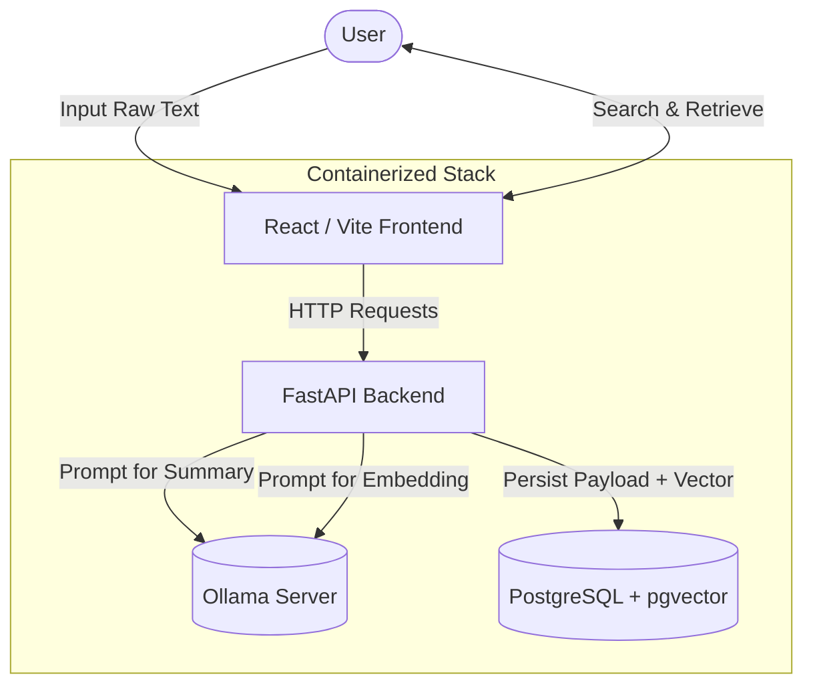
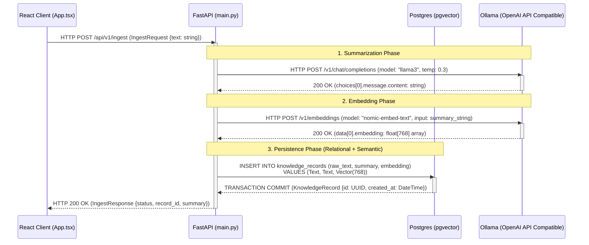
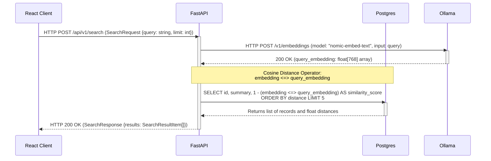

# Phase 1: MVP Architecture

ShizenAI Phase 1 establishes the foundational data ingestion and semantic search pipelines. The goal of this phase was to construct a "Local-First" environment capable of taking unstructured text, summarizing it, vectorizing the summary, and persisting it to a database capable of native cosine similarity searches.

Below are the architectural diagrams detailing both the high-level intent and the low-level, technically rigorous data flows.

---

## 1. High-Level Architecture (The "What")

At a macro level, the system is composed of four containerized services that run locally on the developer's machine. 

The user interacts with the **Frontend**, which delegates heavy lifting to the **Backend**. The Backend acts as the orchestrator: it converses with **Ollama** to synthesize intelligence (summaries and vector math), and then persists the mathematical truth to **PostgreSQL**.

---

## 2. Low-Level Architecture & Data Flow (The "How")

The actual pipeline is significantly stricter regarding type coercion and dimensional guarantees. The sequence relies heavily on Pydantic validation on the FastAPI boundary, and strict `Vector(768)` dimensions natively inside Postgres.

### Data Types & Dimensions
- **Text Payload**: Stored as native `TEXT` inside Postgres.
- **Summary**: Stored as native `TEXT`. Generated by `llama3`.
- **Embedding Dimensions**: `768-dimensional float arrays`, natively emitted by `nomic-embed-text` and asserted at the database layer via `$ embedding = Column(Vector(768), nullable=False)`.

### Ingestion Sequence Diagram

### Retrieval Sequence Diagram

