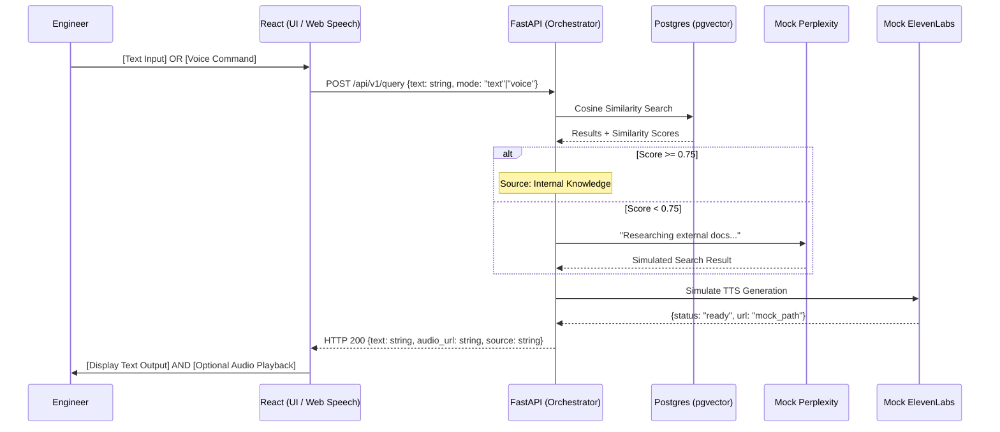

# PRD: ShizenAI Phase 2 – Hybrid Orchestration & Inclusive I/O

## 1. Objective
To implement the Confidence-Based Routing engine and a multimodal interface (Voice/Text). This phase establishes the logic that decides when to use local data versus external "mocked" knowledge, while providing a seamless text-fallback for accessibility (Deaf/Hard of Hearing) and system resilience.

## 2. High-Level Requirements
- **Confidence Gateway:** Threshold-based logic to route queries between local pgvector and an external mock service.
- **Multimodal I/O:** Support for both Speech-to-Text (STT) and Manual Text Input.
- **Universal Text Output:** All responses must be rendered as text first, with the audio layer (currently mocked) as a secondary enhancement.
- **Mocked Service Layer:** Standardized interfaces for `External_Search_Provider` and `Audio_Synthesis_Provider`.

## 3. Functional Specifications

### 3.1 The Confidence Gateway (Backend Logic)
The FastAPI backend acts as the "Traffic Controller."
- **Primary Source:** Local PostgreSQL (pgvector) knowledge base.
- **The Threshold:** A configurable `CONFIDENCE_SCORE` (Default: 0.75).
- **Routing Logic:**
  - `IF similarity_score >= 0.75`: Return the local document summary.
  - `ELSE`: Trigger `Mock_External_Search()` to simulate a Perplexity API call.
- **Metadata:** Every response must include a `source_origin` tag (e.g., "local_db" or "external_search") for transparency.

### 3.2 Accessibility-First Interface (Frontend)
The React client must handle users who cannot hear or prefer not to speak.
- **Dual-Mode Input:** A persistent text input field paired with a "Tap-to-Talk" mic button.
- **The Transcript View:** A chat-style interface that displays the assistant's response in real-time, ensuring information is accessible regardless of audio status.
- **Visual Confidence Indicator:** A subtle UI cue (e.g., a small green or blue icon) indicating whether the info came from internal company docs or external research.

### 3.3 Mocked Providers (Phase 2 Scaffolding)
To maintain development speed, the following services are mocked:
- **ElevenLabs Mock:** A backend function that simulates audio generation delay and returns a `mock_audio_url`.
- **Perplexity Mock:** A function that utilizes the local Llama 3 model with a specific "Research Assistant" system prompt to simulate an external web-search result.

## 4. Technical Architecture (Multimodal Flow)

## 5. Success Metrics for Phase 2
- **Zero-Failure Routing:** 100% of queries with low similarity scores correctly trigger the Mock Search.
- **Accessibility Parity:** All information delivered via the (mocked) audio is simultaneously visible in the text transcript.
- **System Stability:** Core application RAM usage remains stable under 12GB total (OS + Docker + Local LLM) on the Ryzen 5.

## 6. Development Priorities
1. **Backend Confidence Logic:** Implement the if/else gateway in the FastAPI endpoint.
2. **Multimodal Frontend:** Add the text-entry field alongside the Web Speech API button.
3. **Llama 3 "Research" Prompt:** Configure a specific Ollama prompt to act as the "External Search" mock, providing a different "personality" than the internal summarizer.
